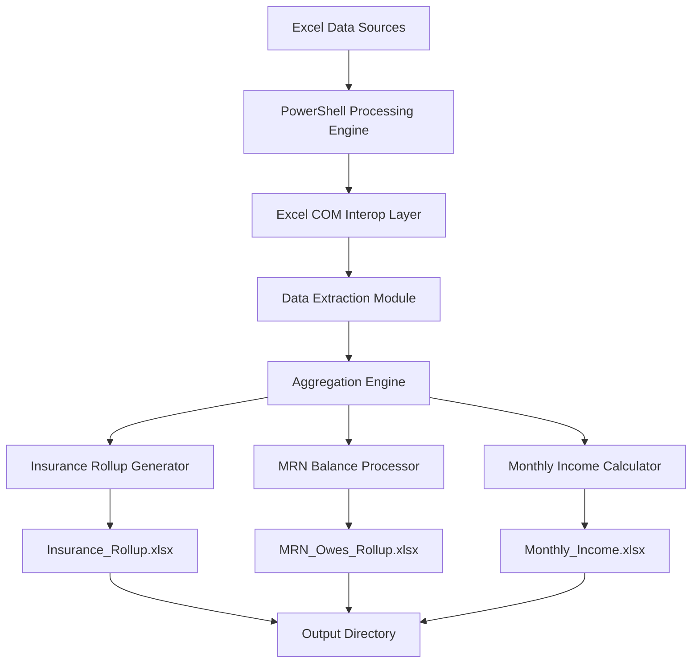
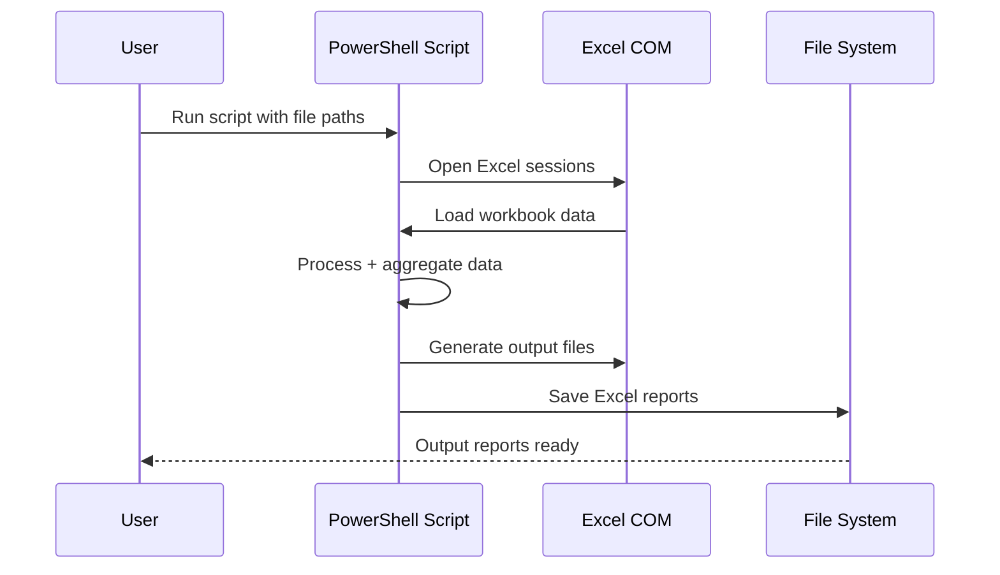

# Annual Rollup Automation System

Production-deployed PowerShell automation system for aggregating and summarizing financial data across multiple Excel workbooks, generating structured insurance, patient, and monthly financial rollups.

---

## 🧠 System Overview

This system automates financial reporting by consolidating multiple Excel data sources into structured summary outputs.

It replaces manual spreadsheet aggregation with a deterministic, script-driven workflow that ensures consistency, accuracy, and repeatability.

---

## 🎯 Problem It Solves

Manual financial reporting across multiple Excel files leads to:

- Time-consuming spreadsheet consolidation  
- Inconsistent formatting across reports  
- Human error in calculations and rollups  
- Repetitive monthly/annual reporting tasks  
- Lack of standardized output structure  

This system automates the full aggregation pipeline.

---

## 🏗 System Architecture

---

## ⚙️ Core Features

- Processes multiple Excel workbooks (Jan–Jul, Jul–Dec, Self Pay)
- Aggregates insurance billing data
- Calculates patient MRN balances
- Computes monthly income summaries
- Handles inconsistent or missing Excel data
- Auto-formats output spreadsheets
- Generates structured financial reports
- Fully automated execution via PowerShell

---

## 🧠 System Workflow

1. User provides input Excel file paths  
2. PowerShell script initializes Excel COM session  
3. Data is extracted from multiple workbooks  
4. Headers are normalized for consistency  
5. Aggregation engine processes:
   - Insurance rollups (Billed / Paid / Unpaid)
   - MRN outstanding balances
   - Monthly income totals  
6. Structured output files are generated  
7. Excel session is safely closed  
8. Output files are saved to target directory  

---

## ⚙️ Engineering Design

### Processing Model
- Sequential batch processing of Excel sources
- Deterministic aggregation logic
- Memory-safe Excel COM handling

### Data Handling
- Dynamic header detection
- Input normalization layer
- Defensive parsing for inconsistent rows

### Output Layer
- Standardized Excel report generation
- Auto-formatted headers and numeric fields
- Clean export structure for downstream use

---

## 🧩 System Components

- **PowerShell Execution Engine** → Orchestrates workflow
- **Excel COM Interop Layer** → Controls Excel programmatically
- **Data Extraction Module** → Reads raw workbook data
- **Aggregation Engine** → Performs rollup calculations
- **Report Generator** → Produces structured outputs

---

## 🛡 Reliability Considerations

- Safe Excel session teardown to prevent memory leaks  
- Error handling for corrupted or missing files  
- Graceful failure on malformed datasets  
- Defensive parsing of inconsistent spreadsheet formats  
- Isolation of processing steps to prevent cascading failures  

---

## 📈 Scaling Limitations

This system is optimized for:

- Local Windows environments  
- Medium-sized Excel datasets  
- Batch processing workflows  

Constraints include:

- Excel COM dependency (Windows-only)
- Sequential processing model
- Limited parallel execution capability

---

## 🔄 Execution Flow

---

## 🛠 Tech Stack

- PowerShell 5+
- Microsoft Excel COM Interop
- Windows Operating System
- File system-based data processing

---

## 📌 Output Files

Generated reports include:

- **Insurance_Rollup.xlsx**
  - Insurance | Billed | Paid | Unpaid

- **MRN_Owes_Rollup.xlsx**
  - MRN | Outstanding Balance

- **Monthly_Income.xlsx**
  - Month | Total Income

---

## 🚀 Future Improvements

- Add structured logging system  
- Replace Excel COM with EPPlus or closedXML (cross-platform support)  
- Add GUI wrapper for non-technical users  
- Automate scheduling via Task Scheduler integration  
- Add database-backed historical tracking  
- Email report distribution system  

---

## 📫 Contact

📧 SURECATCHAUTOMATIONS@GMAIL.COM
