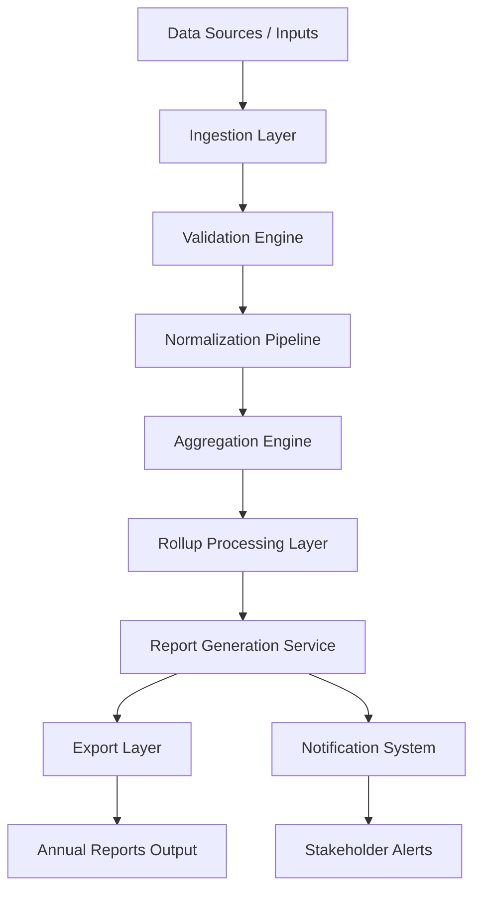

# Architecture — Annual Rollup System

## 🧠 System Purpose

This system is a workflow-based data aggregation engine that processes multi-source datasets into structured annual rollup reports.

It follows an event-driven ETL-style architecture.

---

## 🏗 AWS-Style Architecture

---

## ⚙️ Core Components

- **Ingestion Layer** → collects structured datasets
- **Validation Engine** → ensures data integrity
- **Normalization Pipeline** → standardizes formats
- **Aggregation Engine** → combines yearly metrics
- **Rollup Layer** → calculates summaries
- **Report Generator** → builds final outputs
- **Export System** → delivers reports
