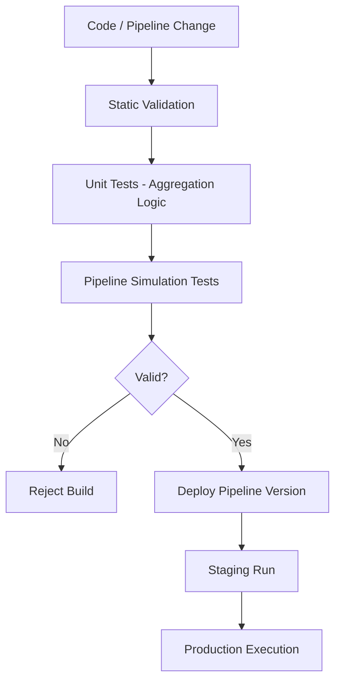

# CI/CD — Annual Rollup System

## 🧠 Purpose

Defines safe execution and deployment flow for data aggregation and reporting pipelines.

---

## 🚀 AWS-Style CI/CD Pipeline

---

## ⚙️ Key Principles

- No deployment without pipeline validation
- Deterministic aggregation behavior
- Safe rollback of reporting logic
- Versioned pipeline execution
