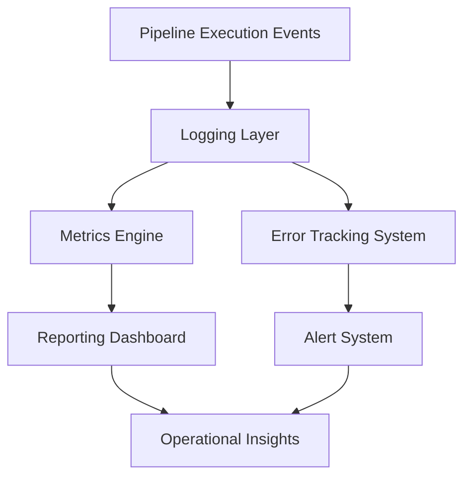

# Observability — Annual Rollup System

## 🧠 Purpose

Provides visibility into data processing, aggregation accuracy, and report generation performance.

---

## 📊 Observability Architecture



---

## 📈 Key Metrics

- Data ingestion volume
- Validation failure rate
- Aggregation processing time
- Report generation latency
- Export success rate

---

## 🧠 Debug Model

Every report must be traceable:

```
Input Data → Validation → Aggregation → Rollup → Output Report
```
