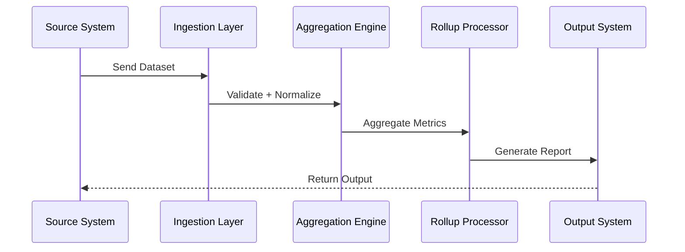

# Real-Time Processing — Annual Rollup System

## 🧠 Purpose

Defines how datasets are processed through the system in near real-time batch workflows.

---

## ⚡ Event Flow Architecture

---

## 🧩 Real-Time Behavior

- Batch-based near real-time processing
- Event-driven pipeline execution
- Incremental aggregation support
- Immediate report availability after processing

---

## 🎯 Design Goal

Ensure structured datasets are processed into accurate annual summaries with minimal delay.
