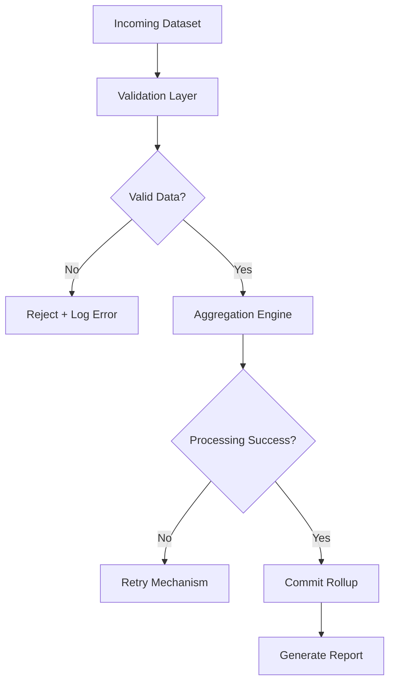

# Reliability — Annual Rollup System

## 🧠 Purpose

Ensures accuracy and consistency of aggregated reports under failure conditions.

---

## ⚙️ Reliability Architecture

---

## 🔒 Reliability Guarantees

- No partial reports generated
- Atomic aggregation operations
- Safe retry for failed pipelines
- Deterministic outputs for identical inputs

---

## 🧠 Failure Model

System ensures:

- Either FULL report generation
- OR clean failure state

No corrupted outputs allowed.
