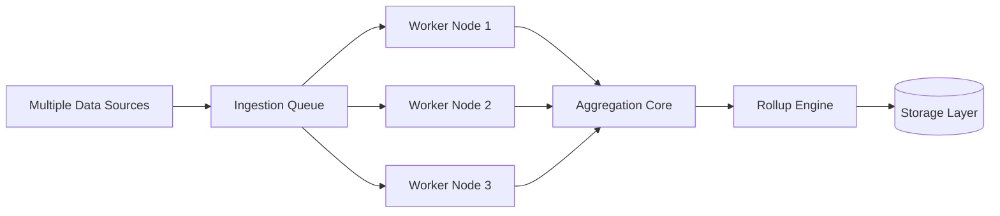

# Scaling — Annual Rollup System

## 🧠 Purpose

Defines how the system handles increasing dataset volume and parallel processing demands.

---

## 📊 Scaling Architecture

---

## ⚙️ Scaling Strategy

- Parallel ingestion workers
- Queue-based processing model
- Batch aggregation optimization
- Decoupled pipeline stages

---

## 🧠 Scaling Constraints

- Aggregation consistency must be preserved
- Ordering may be relaxed, correctness is not
- Pipeline must remain deterministic under load
